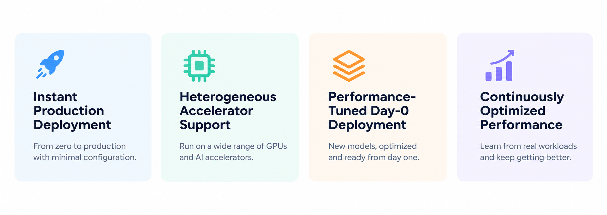
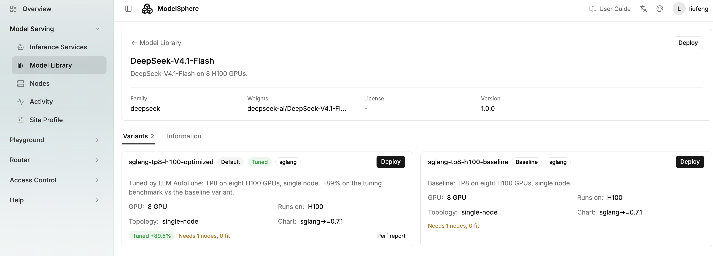
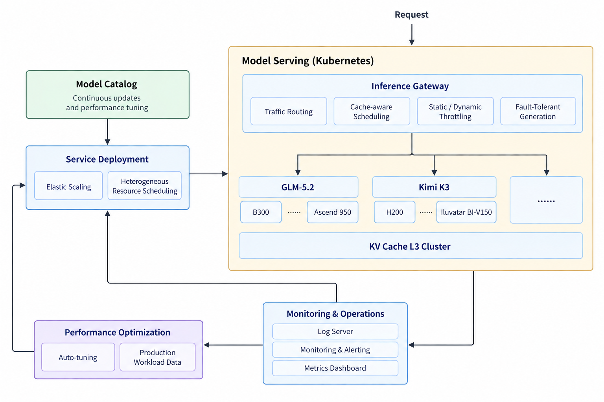

# ModelSphere：面向大模型推理的生产级基础设施

<p align="center">
  <a href="./LICENSE"></a>
  <a href="https://github.com/modelsphere"></a>
  <a href="docs/install.md"></a>
</p>

<p align="center">
  <a href="./README.md">English</a> | 简体中文
</p>


## 概述

ModelSphere 是一个开源的大模型推理基建平台，目标是让生产级的模型服务变得简单、高效，并能持续优化。它支持在异构算力集群上一键部署，依托灵活的推理架构及时跟进最新模型，并根据真实业务负载持续提升服务性能。



## 核心特性

- **智能弹性伸缩。** 根据实时服务需求动态调整推理副本数和计算资源，并优先保障高优先级模型的资源，从而提升整体 GPU 利用率。
- **质量感知的动态限流。** 不局限于传统的 RPM/TPM 限制，而是基于 TTFT、输出速度等实时服务指标动态控制流量，在负载变化时保持服务质量。
- **先进的推理服务架构。** 支持 Prefill/Decode 分离、统一 L3 KV cache 池等先进推理架构，实现服务实例间的高效缓存共享和更高的资源利用率。
- **经过性能调优的 Day-0 部署。** 快速支持新发布的模型，提供面向真实服务负载优化、可直接用于生产的部署配置。更多信息请参阅我们的[模型目录](https://modelsphere.github.io/model-catalog/)。
- **广泛的异构加速器支持。** 在 NVIDIA GPU、华为昇腾、天数智芯 CoreX 以及数十种其他 AI 加速器上提供统一的服务栈，并支持 SGLang、vLLM 等主流推理框架。
- **生成中断的无缝恢复。** 当某个服务 Pod 在生成过程中发生故障时，ModelSphere 会将进行中的请求转移到健康的 Pod 上，并从中断处继续生成，无需重启请求，也不会打断客户端的流式输出（[了解更多](https://github.com/modelsphere/continuation_gateway)）。
- **负载驱动的自动调优（预览版）。** 利用真实生产负载，在计算资源空闲时段自动探索更优的服务配置（[了解更多](https://github.com/modelsphere/llm-autotune)）。

## 快速开始

### **前置条件**

1. 一个 Kubernetes 集群，并且 `kubectl` 已指向该集群；
2. `helm`、`helmfile` 以及 `helm-diff` 插件。

### **第 1 步：安装服务栈**

```bash
# 1. 安装服务栈本身，一次完成
cp environments/private.yaml.example environments/mycluster.yaml   # 编辑该文件，
#    然后在 helmfile.yaml.gotmpl 的 `environments:` 下注册它 —— 没有被注册的
#    values 文件，helmfile 根本不会读取：
#      mycluster:
#        values:
#          - environments/default.yaml
#          - environments/mycluster.yaml
make helm-apply ENV=mycluster
```

### **第 2 步：部署模型**

**方式一：使用命令行**

```bash
helm repo add modelsphere https://modelsphere.github.io/helm-charts
helm upgrade --install qwen modelsphere/sglang -n llm-demo --create-namespace \
  -f <your values.yaml>       # models/examples/sglang-qwen.yaml 是一个完整示例
```

模型通过路由层对外提供服务，地址为 `http://openresty.llm-route.svc:8080/<release>/v1/chat/completions` —— 第 2 步中的 release 名称（上例中为 `qwen`）就是路径前缀，路由器正是据此选择模型的。

**方式二：使用图形化平台**

你也可以通过图形化平台来部署模型。



### **第 3 步：测试服务**

```bash
kubectl -n llm-route port-forward svc/openresty 8080:8080 &
curl http://127.0.0.1:8080/qwen/v1/chat/completions \
  -H 'Content-Type: application/json' \
  -d '{"model":"Qwen/Qwen2.5-0.5B-Instruct",
       "messages":[{"role":"user","content":"hello"}],"max_tokens":32}'
```

如需将服务暴露到集群外部，可自行选择 Gateway、Ingress 或 Service —— [安装指南](docs/install.md#7-gateway-objects)中提供了相应的 Gateway API 对象。

## 架构




## 组件

| 组件 | 功能 | 仓库 |
|---|---|---|
| **路由** | | |
| llm-openresty | 会话亲和路由器：将一段对话固定到已持有其上下文的后端 | [llm-openresty](https://github.com/modelsphere/llm-openresty) |
| cache_aware_router (CART) | 将每个请求路由到持有最长匹配前缀的副本 | [cache_aware_router](https://github.com/modelsphere/cache_aware_router) |
| autoconfig | Operator，使路由层的配置与实际存在的后端保持同步 | [autoconfig](https://github.com/modelsphere/autoconfig) |
| **伸缩与健康** | | |
| llm-operator | 基于大模型特有的信号（KV cache 压力、队列深度）对推理负载进行自动伸缩 | [llm-operator](https://github.com/modelsphere/llm-operator) |
| slo-scaler-decision-gen | 将 SLO 目标和实时信号转化为副本数决策 | [slo-scaler-decision-gen](https://github.com/modelsphere/slo-scaler-decision-gen) |
| hang-watcher | Sidecar，当引擎已停止推进但仍能响应 `/health` 时将其重启 | [hang-watcher](https://github.com/modelsphere/hang-watcher) |
| **可观测性** | | |
| bodylog, bodylog-exporter | 来自路由器的完整请求/响应记录，以及基于这些记录生成的 Prometheus 指标 | [llm-openresty](https://github.com/modelsphere/llm-openresty) |
| **推理引擎** | | |
| sglang, vllm charts | 引擎二进制直接使用上游版本；这些 chart 负责让它们真正可用于服务：先排空进行中的请求、再释放 GPU 的优雅停机，接入存活探针的 hang-watcher，模型专属的 CART，跨多节点的单实例（LeaderWorkerSet），以及将模型接入路由器的路由与伸缩 CR | [helm-charts](https://github.com/modelsphere/helm-charts) |
| **门户** | | |
| console | ModelSphere 社区门户：身份管理（用户、角色、登录），以及通往 Swiss 及其他后端的联邦网关 | [console](https://github.com/modelsphere/console) |

## 文档

| 文档 | 内容 |
|---|---|
| [`docs/install.md`](docs/install.md) | 完整的安装流程：准备机器、创建 Kubernetes 集群并在其上安装服务栈 —— 离线（air-gapped）安装方式及各步骤的详细说明均可从这里找到 |
| [`docs/configuration.md`](docs/configuration.md) | 运行起来之后需要修改什么、在哪里修改：集群环境文件与模型 values 文件的区别，以及模型、路由与限流、CART、自动伸缩和滚动更新等指南的入口 |
| [`docs/console.md`](docs/console.md) | 首次打开门户：访问地址、首次登录，以及 Model Serving 页面所需的前提条件 |

## 参与贡献

请阅读[贡献指南](CONTRIBUTING.md)，了解某项改动应提交到哪里（ModelSphere 的大部分代码位于各组件仓库，而非本仓库），以及在提交 Pull Request 之前需要运行哪些检查。

## 许可证

Apache 2.0 —— 详见 [LICENSE](./LICENSE)。
